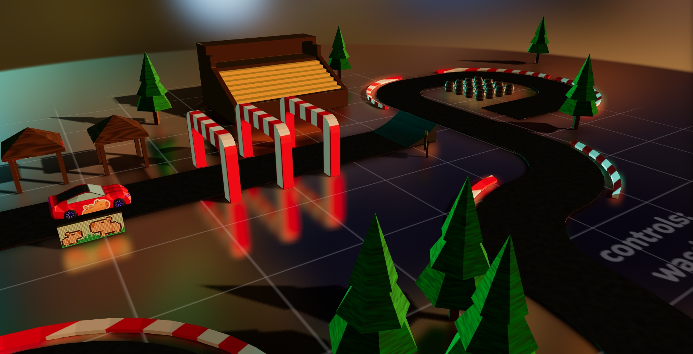

# 3D Racing Game

A dynamic and interactive 3D car racing game built with React Three Fiber and Cannon.js physics. This web-based game demonstrates the power of modern web technologies to create immersive 3D experiences directly in the browser.



## 🎮 Game Features

- **Realistic Physics**: Experience genuine car physics with Cannon.js, including suspension, acceleration, braking, and drifting.
- **Multiple Camera Views**: Press 'C' to cycle through different viewpoints, including a driver's perspective.
- **Interactive Environment**: Navigate around a custom-designed race track with various obstacles and ramps.
- **Performant 3D Rendering**: Built with Three.js and React Three Fiber for smooth performance.
- **Responsive Controls**: Intuitive keyboard controls for a seamless racing experience.
- **Stunts and Tricks**: Perform flips and stunts by using the ramps spread around the track.

## 🕹️ Controls

- **W** - Accelerate forward
- **S** - Reverse/Brake when moving forward
- **A** - Turn left
- **D** - Turn right
- **Space** - Handbrake
- **C** - Change camera view

## 💻 Technologies Used

This project leverages several modern web technologies:

- **React**: For UI components and state management
- **React Three Fiber (R3F)**: React renderer for Three.js, making 3D scenes more manageable in React
- **Three.js**: The core 3D library powering the visual experience
- **Cannon.js**: Physics engine for realistic movement and collisions
- **Vite**: Next-generation frontend tooling for faster development

## 🚀 Getting Started

### Prerequisites
- Node.js and npm/yarn installed on your machine

### Installation

```bash
# Clone this repository
git clone [your-repo-url]

# Navigate to the project directory
cd my-racing-game

# Install dependencies
npm install
# or
yarn

# Start the development server
npm run dev
# or
yarn dev
```

The game will be available at http://localhost:5173 in your browser.

## 📁 Project Structure

```
my-racing-game/
├── public/                    # Static assets
│   ├── models/                # 3D model files (.glb format)
│   ├── textures/              # Texture files and environment maps
│   └── screenshots/           # Game screenshots
│
├── src/
│   ├── assets/                # Asset files
│   │   └── global.css         # Global CSS styles
│   │
│   ├── components/            # React components
│   │   ├── Scene.jsx          # Main scene component
│   │   ├── Car.jsx            # Car model and physics
│   │   ├── Ground.jsx         # Ground plane
│   │   ├── Track.jsx          # Race track with collisions
│   │   ├── Barrel.jsx         # Barrel obstacles
│   │   ├── Ramp.jsx           # Jump ramps
│   │   ├── ColliderBox.jsx    # Collision boxes
│   │   └── GameUI.jsx         # User interface component
│   │
│   ├── hooks/                 # Custom React hooks
│   │   ├── useControls.jsx    # Keyboard controls
│   │   └── useWheels.jsx      # Wheel physics and behavior
│   │
│   └── main.jsx               # Application entry point
│
├── index.html                 # HTML entry point
├── package.json               # Project dependencies and scripts
├── vite.config.js             # Vite configuration
└── README.md                  # Project documentation
```

## 🔧 Customization

You can customize various aspects of the game:

- Modify car physics in `src/components/Car.jsx`
- Change the track layout in `src/components/Track.jsx`
- Add new objects by creating new components
- Adjust the camera settings in `src/components/Scene.jsx`

## 🏗️ Building for Production

To build the game for production:

```bash
npm run build
# or
yarn build
```

This will generate a `dist` folder with optimized production files that can be deployed to any static hosting service.

## 🌐 Deployment

The game can be deployed to various hosting platforms:

- **GitHub Pages**: Perfect for hobby projects and demos
- **Netlify/Vercel**: Supports continuous deployment from your repository
- **AWS S3/CloudFront**: For scalable hosting solutions

## 📝 Development Notes

- The game uses Cannon.js for physics which can be computationally intensive. Performance optimization may be needed for complex scenes.
- Three.js and React Three Fiber are rapidly evolving libraries. Keep dependencies updated for the best performance and features.
- Mobile controls are not yet implemented but could be added using touch events or virtual joysticks.

## 🚧 Future Improvements

- Add a lap timer and race functionality
- Implement multiplayer capabilities
- Add more vehicles with different handling characteristics
- Create additional tracks and environments
- Add mobile touch controls
- Implement sound effects and background music

---

Created with ❤️ using React Three Fiber 